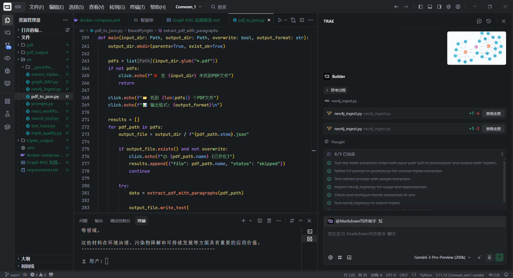

## 1. 前置工具学习心得

在本项目开始前，我深入学习并配置了开发所需的基础工具链，构建了高效的开发环境。

|     工具名称     |      用途       | 学习心得                                               |
| :----------: | :-----------: | :------------------------------------------------- |
| Cursor/Trae  | IDE / AI 编程助手 | 极大地提升了代码编写效率，AI 补全非常智能。                            |
|     Git      |     版本控制      | 确保了代码迭代过程中的安全性和可追溯性，方便回滚和分支管理。                     |
| CherryStudio |    API 调试     | 用于快速测试 LLM API 的连通性和响应格式，帮助我在编写代码前验证了 Prompt 的有效性。 |

 


## 2. PDF 解析与 JSON 格式化

#### 2.1 过程描述
为了将非结构化的 PDF 论文转换为机器可读的格式，我编写了 `pdf_to_json.py` 脚本。

|   步骤   |   操作   |                     描述                     |
| :----: | :----: | :----------------------------------------: |
| Step 1 | 读取 PDF |             遍历指定目录下的所有 PDF 文件。             |
| Step 2 |  文本提取  | 利用 `pymupdf` (fitz) 提取每一页的文本，并清洗多余空格和页眉页脚。 |
| Step 3 | 结构化存储  |     将文本块保存为 JSON，保留源文件名和页码信息，为后续溯源做准备。     |

#### 2.2 示例 JSON 输出
以下是两个 PDF 解析后的 JSON 片段示例：

**示例 1: 论文 A 片段**
```json
{
  "file_name": "Improving_frequency_stability.pdf",
  "blocks": [
    {
      "page": 1,
      "text": "Adaptive Model Predictive Control (AMPC) is proposed to enhance the frequency stability of grid-forming inverters..."
    },
    {
      "page": 1,
      "text": "Traditional MPC struggles with dynamic constraint handling during islanding transitions..."
    }
  ]
}
```
**示例 2: 论文 B 片段**
```json
{
  "file_name": "Microgrid_Control_Strategies.pdf",
  "blocks": [
    {
      "page": 3,
      "text": "Virtual Synchronous Machines (VSM) mimic the inertia of synchronous generators to support grid frequency."
    }
  ]
}
```
## 3. LLM 驱动的三元组抽取

#### 3.1 提示词设计
为了从文本中精准抽取 **(Subject, Predicate, Object)** 三元组，我设计了如下 System Prompt：

你是学术信息抽取助手。只返回JSON,键为 triples。请提取文本中核心的学术知识三元组(因果、定义、属性、方法)。
要求:
1. 实体和关系必须精炼简洁,subject和object尽量为名词短语,predicate为动词短语。
2. 避免提取冗长、无关紧要或修饰性过强的三元组。
3. 实体名称在保持准确的前提下尽量简短。
4. 不要推断;严格JSON,无任何附加文本。

#### 3.2 智能体工作流
利用 `LlamaIndex` 构建了一个抽取管道：

1.  **加载数据**: 读取 JSON 文本块。
2.  **批处理**: 分批发送给 LLM（GPT-4o-mini），避免上下文超长。
3.  **解析验证**: 接收并验证 JSON 字段完整性。
4.  **去重合并**: 对三元组去重，保存为 `triples.json`。

#### 3.3 抽取示例 (JSON)
| Subject (主语)             | Predicate (谓语) | Object (宾语)                       |
| :----------------------- | :------------- | :-------------------------------- |
| `grid-forming inverters` | `require`      | `advanced control strategies`     |
| `AMPC framework`         | `enhances`     | `GFM performance`                 |
| `AMPC framework`         | `combines`     | `offline RL and online MPC`       |
| `COA-jDE`                | `minimizes`    | `cost function Uoffline`          |
| `AMPC`                   | `outperforms`  | `traditional MPC and VSM methods` |

```json
[
  { "subject": "grid-forming inverters", "predicate": "require", "object": "advanced control strategies" },
  { "subject": "AMPC framework", "predicate": "enhances", "object": "GFM performance" },
  ...
]
```

## 4. Neo4j 部署与知识图谱构建

#### 4.1 部署配置
使用 Docker Compose 部署 Neo4j 。

>![[Pasted image 20251206101502.png]]

#### 4.2 知识图谱模式设计

| 元素                | Label/Type  | 属性               | 说明                       |
| :---------------- | :---------- | :--------------- | :----------------------- |
| **节点 (Nodes)**    | `Entity`    | `id`, `name`     | 代表具体的概念或实体。              |
| **关系 (Edges)**    | `Dynamic`   | `source_file`    | 动态生成（如 `ENHANCES`），包含来源。 |
| **社区(Community)** | `Community` | `summary`, `cid` | 聚类生成的社区节点，包含 LLM 生成的摘要。  |

#### 4.3 导入脚本关键代码
使用 `neo4j` Python 驱动进行批量导入：

```python
def ingest_triples(session, triples):
    query = """
    UNWIND $batch AS row
    MERGE (s:Entity {id: row.subject})
    SET s.name = row.subject
    MERGE (o:Entity {id: row.object})
    SET o.name = row.object
    WITH s, o, row
    CALL apoc.create.relationship(s, row.predicate, {}, o) YIELD rel
    RETURN count(*)
    """
    # 分批执行导入...
```

#### 4.4 构建后的图谱可视化
>![[neo4j@neo4j___localhost_7687_neo4j - Neo4j Browser - Google Chrome 2025_12_6 10_16_02.png]]
## 5. Graph RAG 社区发现与向量化方案

我们采用 **Louvain 算法**进行社区发现，并结合LLM生成摘要，最终通过向量模型和数据库实现高效的语义检索。

|     组件     |      选型/算法      |                 参数配置                 | Rationale (选型依据)                                                                                        |
| :--------: | :-------------: | :----------------------------------: | :------------------------------------------------------------------------------------------------------ |
| **社区发现算法** |   gds.louvain   | `maxLevels: 10`, `maxIterations: 10` | Louvain 算法能够有效揭示图中的层次化社区结构，且 GDS 实现版本性能极高。参数设置旨在平衡计算开销和社区划分的稳定性。                                        |
|  **回退机制**  |    NetworkX     |        `louvain_communities`         | 为保证系统健壮性，当 GDS 服务不可用时，系统可自动降级，使用 NetworkX 在内存中完成计算，确保核心功能不受影响。                                          |
|  **社区摘要**  |   GPT-4o-mini   |                  -                   | 利用 LLM 对每个社区内的实体和关系进行总结，生成高度概括的文本摘要。这为后续检索提供了更高层次、更精准的入口点。                                              |
|  **向量模型**  | OpenAIEmbedding |                  -                   | 默认使用 `text-embedding-3-large` 模型，并通过环境变量 `YUNWU_EMBED_MODEL` 支持灵活配置。确保对学术术语的理解和向量表示的准确性，这是实现高质量语义检索的基础。 |
| **向量数据库**  |     Qdrant      |           `batch_size: 10`           | Qdrant 性能卓越，支持丰富的元数据过滤。分批处理策略则保证了在高负载下数据写入的稳定性和效率。                                                      |

> **核心思想**: 该方案的核心在于 **“分而治之”**。首先通过社区发现将庞大的知识图谱划分为多个高内聚的**主题域**，然后利用 LLM 对每个主题域**生成摘要**，最后将这些结构化和非结构化信息**向量化**，存入统一的检索入口。这使得系统能够快速定位到最相关的知识区域，再进行深度挖掘，极大地提升了检索效率和准确性。

## 6. 智能检索工具设计

#### 6.1 设计思路：混合与分层检索

- **混合检索 (Hybrid Search)**: 同时利用**向量语义检索**和**关键词精确匹配**。前者负责理解用户意图，处理模糊和复杂的查询；后者则用于快速定位特定的实体或术语。
- **分层检索 (Hierarchical Search)**: 查询过程分为两个阶段。首先在 **“社区摘要层”** 进行粗粒度检索，快速锁定相关的知识主题域；然后在该主题域内的 **“实体/关系层”** 进行细粒度检索，挖掘具体信息。

#### 6.2 功能描述：两阶段检索策略

该策略确保了检索既高效又精准，其工作流程如下：

1.  **第一阶段：社区摘要检索 (Community-Level Search)**
    - **输入**: 用户提出的自然语言问题 (e.g., “电网频率稳定的先进控制策略有哪些？”)
    - **动作**: 将用户问题向量化，与存储在 Qdrant 中的 **社区摘要向量** 进行语义相似度匹配。
    - **输出**: 返回最匹配的 Top-K 个社区 (e.g., `Community-3: 先进控制策略`, `Community-8: 频率稳定性`)

2.  **第二阶段：实体/关系检索 (Entity-Level Search)**
    - **输入**: 上一阶段返回的 Top-K 社区 ID。
    - **动作**: 在这些社区内部，进行第二次检索。将用户问题与社区内的**实体、关系及其文本描述**进行向量匹配和关键词匹配。
    - **输出**: 返回最相关的具体知识片段（三元组），并结合 LLM 生成最终的自然语言答案。

> ✨ **优势**: 这种设计极大地缩小了检索范围，避免了在整个知识图谱中进行“大海捞针”式的搜索，显著提升了检索效率和结果的相关性。

#### 6.3 检索示例

| 查询示例                   | 返回结果                                         |
| :--------------------- | :------------------------------------------- |
| 什么是 AMPC?              | ![[Pasted image 20251206111505.png]]<br><br> |
| AMPC 和 VSM 方法有什么区别?    | ![[Pasted image 20251206111541.png]]         |
| 如何利用离线强化学习来提升并网逆变器的性能？ | ![[Pasted image 20251206111609.png]]         |

## 7. ReAct 智能体工作流

#### 7.1 设计思路
基于 LlamaIndex 的 ReActAgent，思考过程为根据思考、检索、回答。

#### 7.2 完整思考链 (Chain of Thought) 示例
**用户问题**: "相比于传统的 MPC，AMPC 有什么主要优势？"

| 步骤        | 阶段     | 内容                                                             |
| :-------- | :----- | :------------------------------------------------------------- |
| **Step1** | **思考** | 用户在询问 AMPC 和传统 MPC 的对比。我需要调用检索工具获取相关信息。                        |
| **Step2** | **检索** | 调用 `GraphKnowledgeSearch`，检索到摘要 "AMPC在性能上优于传统的MPC...表现出更少的超调"。 |
| **Step3** | **回答** | "AMPC 相比于传统 MPC 的主要优势包括：1. 更好的频率稳定性；2. 更灵活的控制策略..."            |

#### 7.3 演示截图
![[Pasted image 20251206110933.png]]

![[Pasted image 20251206111046.png]]

![[Pasted image 20251206111106.png]]

## 8. 问题与解决方案及心得

#### 8.1 主要问题与解决方案
| 问题描述 | 解决方案 |
| :--- | :--- |
| **GDS 调用失败** <br> Neo4j GDS 库在某些 Docker 环境下未加载。 | **NetworkX Fallback** <br> 实现自动降级机制，使用 NetworkX 在内存中运行社区发现算法。 |
| **API 变更** <br> LlamaIndex `ReActAgent.from_tools` 方法不可用。 | **适配新 API** <br> 改用构造函数直接实例化，并适配新的 Workflow API 参数。 |
| **异步循环错误** <br> CLI 中使用 `asyncio` 报错。 | **重构 Main 函数** <br> 正确使用 `asyncio.run()` 管理异步上下文。 |

#### 8.2 个人心得
本次实践让我深刻体会到了 Graph RAG 的强大之处。相比于传统的 RAG，引入知识图谱（特别是社区摘要）能显著提升回答的全局性和逻辑性。相比上次学习内容，在本次学习中我更注重 llamaindex 的使用，大大提高了项目效率。

*   **难点**: 处理“结构化图谱”与“非结构化语义”的融合。
*   **亮点**: ReAct 范式让智能体不再是简单的复读机，而是具备了真正的推理和查证能力。
*   **不足**：分层不够细化，还可以更进一步。
